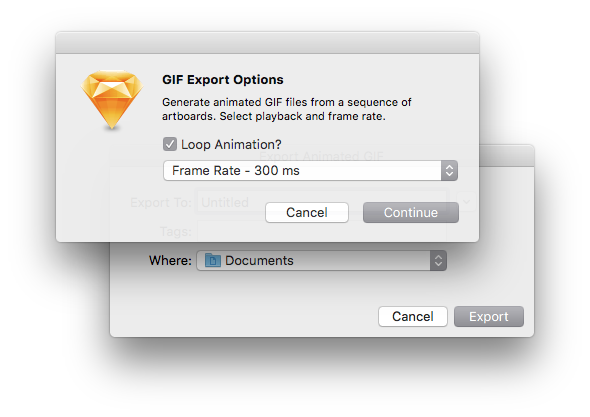

# Export More
Sketch.app plugin adding export support for Apple Icon Image ( .icns ) and Animated GIF ( .gif ) file formats. Based on my previous [Generate ICNS](http://github.com/nathco/Generate-ICNS) and [Generate GIF](http://github.com/nathco/Generate-GIF) plugins. Now compatible with **Mac OS Sierra** and **Sketch 42**.  

## Preview  
    

## Installation
1. Download and open `Export-More-master.zip`  
2. Locate and double-click `Export-More.sketchplugin`
3. Locate the `GIFX` file in the bundle and double-click ( only if plugin fails after install )      

## Animated GIF
Create your content on a sequence of artboards using a `XXX 01`, `XXX 02`, `XXX 03` naming convention, where "XXX" is the artboard name. Each artboard acts as an animation keyframe and will play sequentially according to the naming structure. When ready, navigate to `Plugins ▸ Export More ▸ Artboards to GIF ` and select a playback method and frame animation rate ( see options below ). The file will export to the directory of your choosing. 

**Playback Options**  
`Default: play animation once`    
`Loop: play animation forever`        
  
**Frame Rate Options**  
`No Delay`  
`100ms, 200ms, 300ms, 400ms, 500ms, 600ms, 700ms, 800ms, 900ms`  
`1000ms, 1500ms, 2000ms, 3000ms, 4000ms, 5000ms`           

**Usage Notes**  
If you notice issues with transparency and / or antialiasing, try adding a solid background color to the artboard. You can prevent individual artboards from exporting by appending `Lock` to the name, or selecting only the artboards you need. Frame rate options can be modified by editing the plugin files.  

## ICNS: Automatically  
Create your icon on a single `1024x1024` sized artboard. When ready, navigate to `Plugins ▸ Export More ▸ Artboards to ICNS ` and select `Automatically` from the dropdown menu. The file will export to the directory of your choosing.  

**Sizes Generated**  
`16x16, 32x32, 128x128, 256x256, 512x512`  
`16x16@2x, 32x32@2x, 128x128@2x, 256x256@2x, 512x512@2x`  

**Usage Notes**  
The auto generator will scale-up artboards smaller than `1024x1024` to fulfill the maximum icon size of `512x512@2x`. Be sure to use `1024x1024` for the artboard size, otherwise the hi-res icons will appear blurry. If multiple artboards exist, and none are selected, the first artboard in the layer list will export.

## ICNS: From Sequence  
Create your icon using the **Mac App Icon** template from `File ▸ New From Template ▸ Mac App Icon` in the application menu bar. When ready, navigate to `Plugins ▸ Export More ▸ Artboards to ICNS ` and select `From Sequence` in the dropdown menu. The file will export to the directory of your choosing. 

**Usage Notes**  
The artboard naming structure, for example: `icon_32x32` and `icon_32x32@2x`, must remain intact for the generator to work properly. You can prevent individual artboards from exporting by appending `Lock` to the name.

## Release Notes

**Export More 1.4**        
- Fixed an issue where exports failed on Sierra    

**Export More 1.3**        
- Added option to export GIFs from selected or all artboards

**Export More 1.2**      
- Added more frame rate options  
- Added checkbox for playback option ( loop or once )  
- Minor code cleanup and fixes 

**Export More 1.1**      
- Fixed export options `Cancel` button  

**Export More 1.0**   
- Initial Release  

## Feedback
If you discover any issues or have questions regarding usage, please send a message to [code@nath.co](mailto:code@nath.co) or find me on GitHub [@nathco](https://github.com/nathco).